## Emoji Gallery
## Overview

The Emoji Gallery is a backend service designed to enable users to add predefined emojis to their movie projects. It supports different tiers of users with varying levels of access to emoji resources.

### Features

- **Emoji Gallery**: Users can browse and select from a collection of in-house emojis.
- **User Uploads**: Users can upload their own emojis to reuse in future projects.
- **Emoji Management**: The system allows certain users to upload a limited or unlimited number of emojis based on their subscription tier.

## Getting Started

These instructions will get you a copy of the project up and running on your local machine for development and testing purposes.

### Prerequisites

- Docker
- Docker Compose
- Python 3.8+
- Redis

### Installation

1. Clone the repository:

   git clone [repository URL]
   
Navigate to the project directory:

cd emoji-gallery

Build and run the project using Docker Compose:

docker-compose up --build

### Usage
Once the server is running, you can access the following API endpoints:

GET /gallery: Retrieve a paginated list of emojis available in the gallery.

POST /emoji/: Upload a new user emoji (with different limits based on user tier).

GET /user/emojis/{user_id}: Retrieve a list of emojis uploaded by a specific user.

### Sysyem Design

Components:

Client: The frontend interface that interacts with the user.
API Server (FastAPI): Handles all client requests and serves the appropriate emoji resources.
Redis: Utilized for caching and managing rate-limiting to ensure API performance under load.
Database: (postgresql) Stores user data and emoji metadata.
Scalability
This service is built with scalability in mind, leveraging technologies such as:

 **FastApi**: For a high-performance, asynchronous API that scales with ease.

 **Docker**: To containerize the application, ensuring consistent deployments.
 
 **Redis**: For high-speed data access and rate limiting, reducing load on the database.
-
 **Pagination**: Implemented in the emoji gallery listing to ensure that the database queries are efficient and the memory footprint is minimized. This approach improves load times and resource utilization, making the system more responsive and scalable.

Deployment
For a complete production deployment, consider implementing:

Microservices Architecture: Separation of the user emoji and gallery emoji into separate services.
Load Balancer: To distribute incoming traffic and ensure high availability.
CDN: For serving emoji images efficiently to users worldwide.
S3 (or equivalent): To store and manage emoji images.
Message Queue: To handle asynchronous tasks and decouple service dependencies.

see diagarms here:

